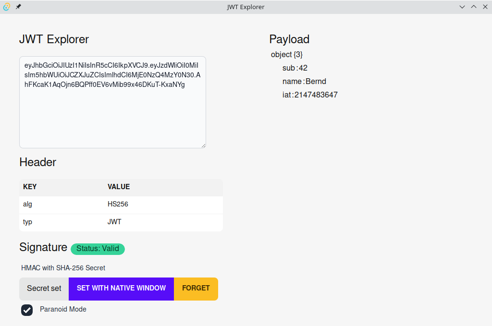

# JWT Explorer

An example [Tauri](https://tauri.app) app to explore & validate [JSON Web Token (JWT)](https://en.wikipedia.org/wiki/JSON_Web_Token).

Currently only supports `HMAC with SHA256 (HS256)` signature validation.

© Bernd Kaiser 2022
